# Prework for Code 401

## SQL

- Relational databases like SQL are what I traditionally understand a tabular DB to work like.  If you want different tables to work with one another you're going to need to conduct joins to query the data, and you're going to need to think very carefully about how the tables are structured and what SPECIFICALLY you're trying to answer.  
- I enjoyed the SQL prework overall.  It felt good to be using syntax that felt more like natural English.
- I've had some experience with SQL in the past as a business analyst, so a lot of this was a refresher.  
- I'm looking forward to seeing how we integrate SQL databases with non-SQL databases and the code that we write.

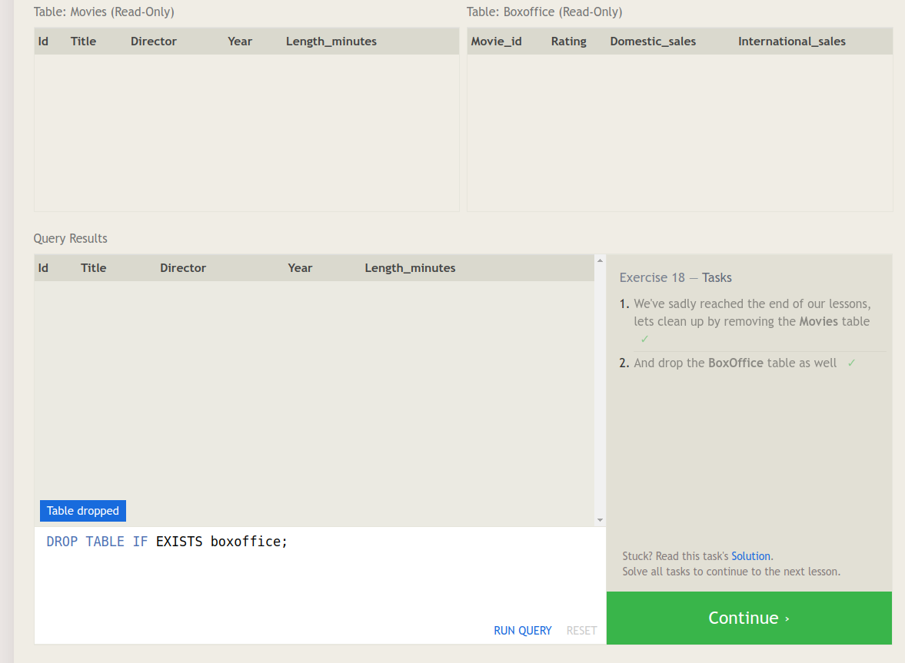
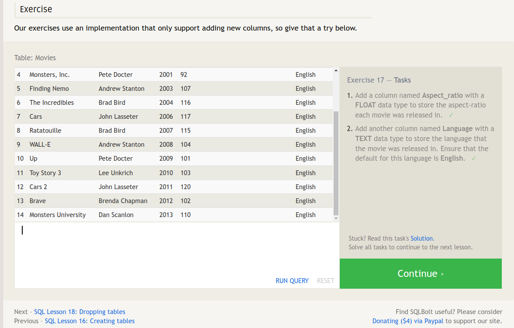
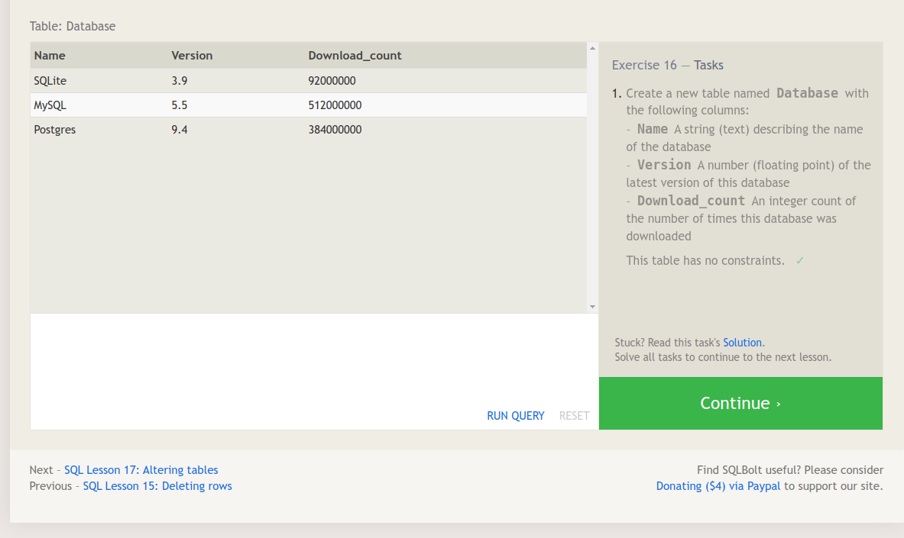
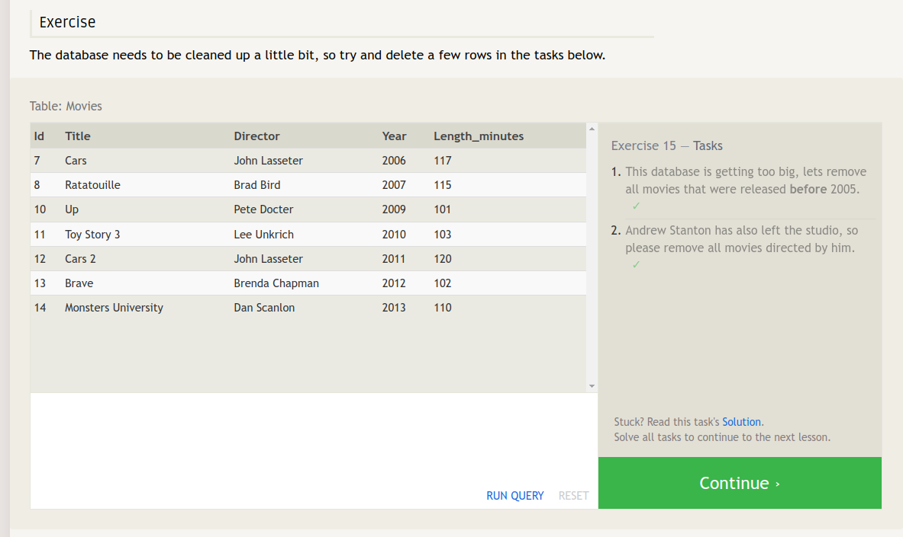
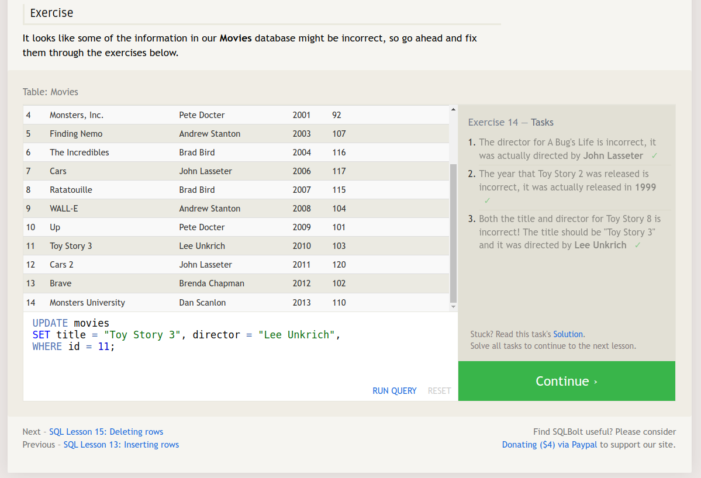
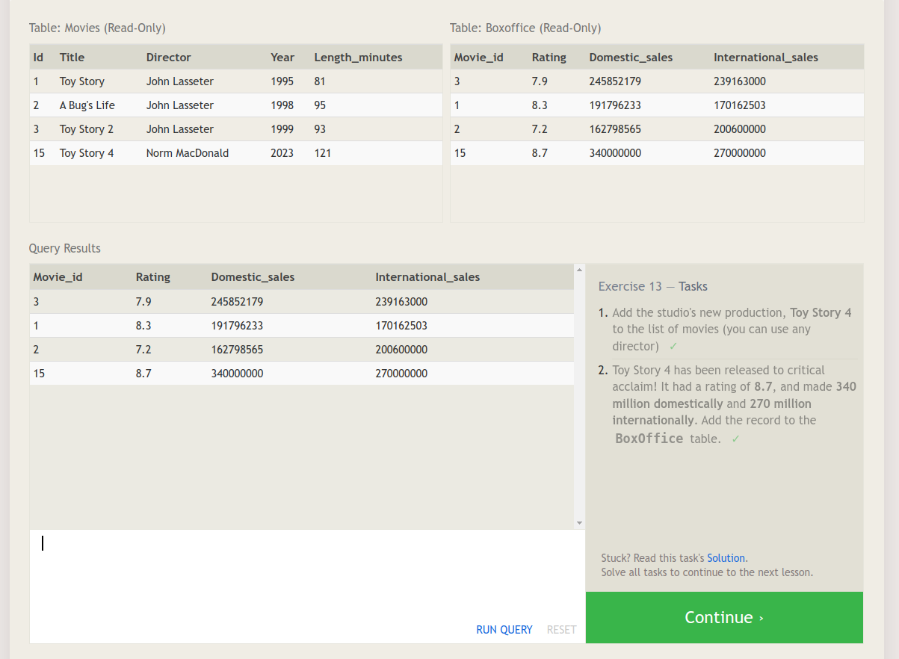
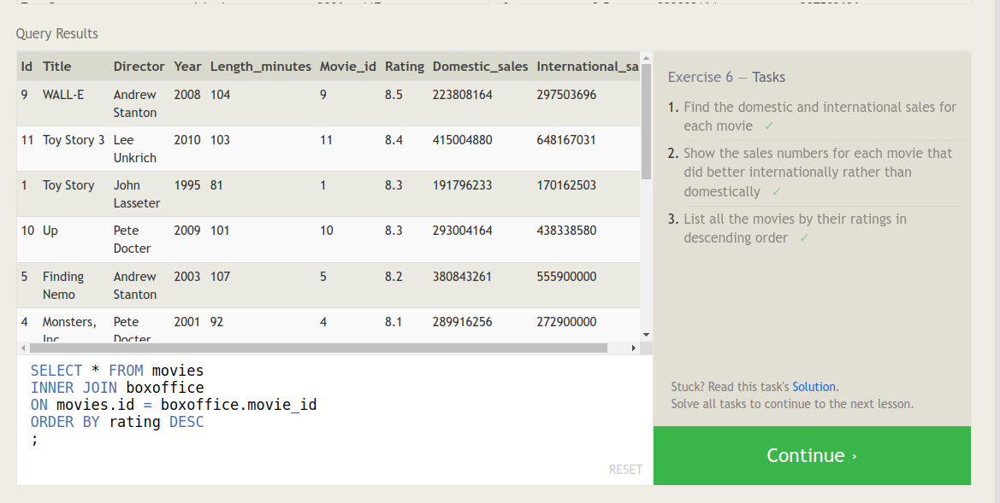

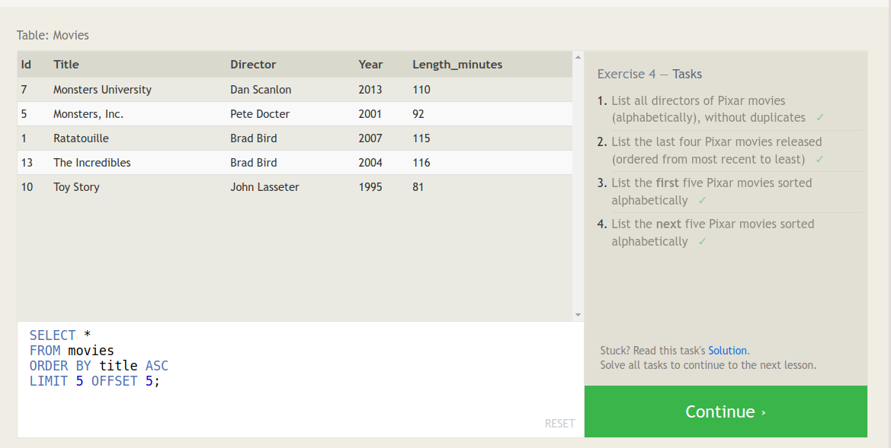
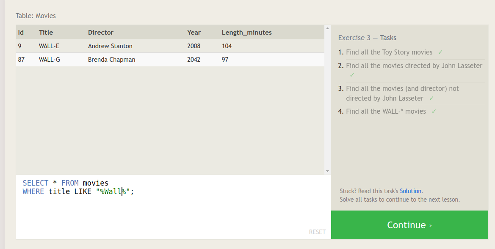
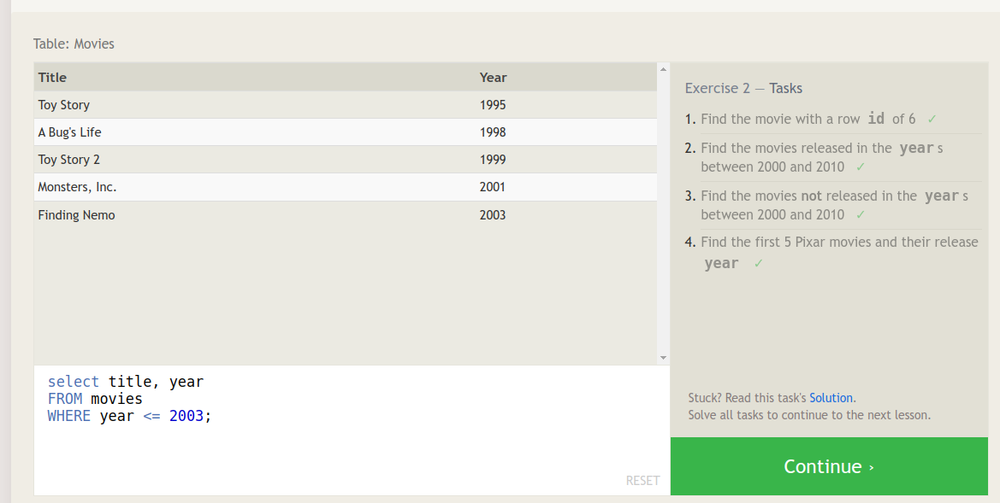
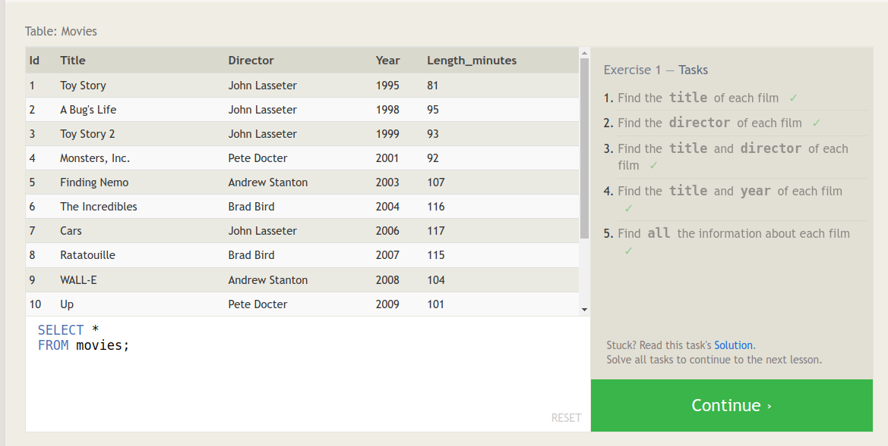

