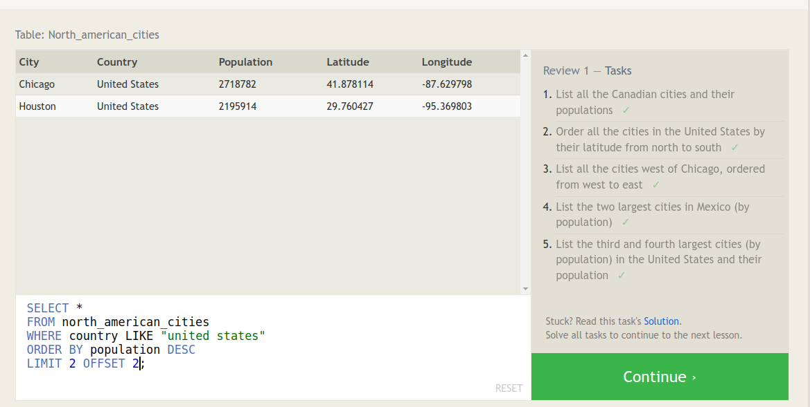

# Prework for Code 401

## SQL

- Relational databases like SQL are what I traditionally understand a tabular DB to work like.  If you want different tables to work with one another you're going to need to conduct joins to query the data, and you're going to need to think very carefully about how the tables are structured and what SPECIFICALLY you're trying to answer.  
- I enjoyed the SQL prework overall.  It felt good to be using syntax that felt more like natural English.
- I've had some experience with SQL in the past as a business analyst, so a lot of this was a refresher.  
- I'm looking forward to seeing how we integrate SQL databases with non-SQL databases and the code that we write.

## Command line notes

I've spent a lot of time on ryanstutorials.net for the command line before this.  When I started code 102 I set up my laptop for Ubuntu 22.04 LTS, and it was the first time in probably 20 years I'd been working with a pure Linux system.  So, getting comfortable with the command line was pretty important.  I think one of my biggest hurdles was actually understanding that it's an extensionless filesystem.  As someone who used Windows systems almost exclusively my whole life that's been pretty tough to track.  I've kept a cheat sheet of the most common commands that I need and then forget, like mkdir, touch and ps.  One thing I'm still not very good at is chaining commands with the `|` operator, but I'm getting better.  I think with some more remediation and some time on a Udemy course I can get to be a power user at the command line.  If I intend to keep using Linux systems it's pretty vital!

## Growth Mindset notes

This isn't the first time I've seen these videos or read that article, but it was worth revisiting because I struggled badly in 301.  I don't disagree with the idea that success and growth are matters of perspective and there's not really anything someone 'can't' learn given enough time, effort and direction.  I don't particularly agree with the idea that passion is a good predictor of future performance; I've been plenty enthusiastic for all sorts of recreational activities I was profoundly unskilled at.  Something I've worked on lately has been to not be defined by my failures because hooooo boy do I fail a lot while learning this material.  I think that the best way for me to employ a growth-oriented mindset is to rely on systems more than goals.  By that I mean, if I've configured the way that I work in a successful fashion, I'm more likely to see success and to meet my goals, regardless of what those goals are.  It's like a modification of the HALT acronym (are you hungry, angry, lonely or tired?)  I generally think of myself as a moist robot, which to me means that I have a lot of control over the inputs in my system, and my happiness and success can both be programmed.  I expect that I can pass this course and learn this material, though I take it as a given that I'll need to retake 301 and 401 in order to solidify the material.  That's not preselecting failure so much as knowing that there's boundaries to how I can succeed that I need my system to account for.  